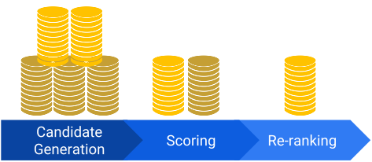

# Recommendation Systems

## Table of Content
- [What are recommendations?](#what-are-recommendations)

## What are Recommendations?
Recommendations are the suggestions served up based on other things the user (e.g. you) like.

## Why Recommendations?
Recommendations allow users to get in touch with compelling content in large corpora, particularly items that the user might not have thought to search for their own.

### Terminologies
Few terminologies to know:
1. Items
    - A.K.A documents
    - For YouTube / Netflix, the items are videos and shows
2. Query:
    - A.K.A context
    - The information used to make recommendations
    - Can be a combination of user information (i.e. user ID, user history) and additional context (i.e. time of day, user device)
3. Embedding
    - A.K.A mapping to vector space
    - A mapping from a discrete set (set of items) to an embedding space

### Recommendation Systems Overview
A recommendation system consists of:
1. Candidate generation
    - Generates a smaller subset of candidates from large corpus
    - E.g. YouTube candidate generator reduces billions of videos down to thousands
2. Scoring
    - Scores and ranks candidates in order
    - Selects a set of sorted items to display to user
3. Re-ranking
    - Take into account additional constraints for final ranking
    - E.g. removing disliked items or boost fresher content

## Short Quiz
1. Why wouldn you use recommendations systems?
    - A. You want to direct users to sponsored items.
    - B. You think you have to sprinkle ML on everything.
    - C. Having recommendation engine makes browsing content easier. (Answer)
2. What are the primary components of a recommender system?
    - A. Embedding, similarity metrics and serving
    - B. Matrix factorization, DNN and re-ranking
    - C. Candidate generation, scoring and re-ranking (Answer)

## Candidate Generation
### Content-based Filtering
### Collaborative Filtering

## Retrieval

## Scoring

## Re-ranking

## Key Takeaways

## Short Quiz

## Demo